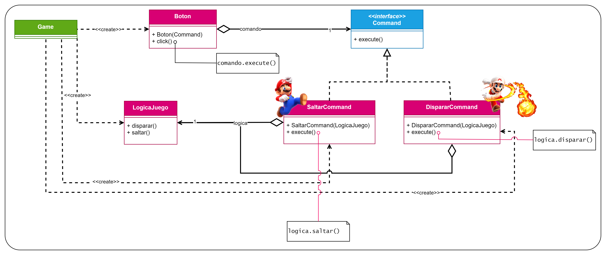

# Patrón Command
Patrón de **comportamiento** (se encarga de como interactúan y se reparten responsabilidades de objetos) y de
**objetos** (usa la composición en vez de la herencia).

Este es el diagrama UML que se utilizó para este ejemplo:


Este patrón es uno de los más complicados y enrevesados. Vamos a explciarlo con nuestro ejemplo del Videojuego.
Nuestro videojuego tiene botones (todos los que queramos), y queremos que el propio usuario pueda decidir con que botón
prefiere saltar y con cual prefiere disparar. Si lo hicieramos "a lo bruto" tendríamos algo así:
```java
// Boton.java - Código altamente acoplado
public class Boton {
    private LogicaJuego logica;
    private String nombreBoton; // Ej: "A" o "B"

    public Boton(LogicaJuego logica, String nombreBoton) {
        this.logica = logica;
        this.nombreBoton = nombreBoton;
    }

    public void click() {
        // Lógica rígida basada en condiciones duras (Hardcoded)
        if (nombreBoton.equals("A")) {
            logica.saltar(); 
        } else if (nombreBoton.equals("B")) {
            logica.disparar();
        }
    }
}
```

Y en nuestro gestor del juego (Game), tendríamos que inicializarlo todo de forma fija:
```java
public class Game {
    public void init() {
        LogicaJuego logica = new LogicaJuego();
        
        // Los botones nacen sabiendo exactamente qué hacer y no pueden cambiar
        Boton botonA = new Boton(logica, "A"); 
        Boton botonB = new Boton(logica, "B");

        botonA.click(); // Siempre ejecutará logica.saltar()
    }
}
```

## 🛑 ¿Por qué está mal?
Haciéndolo así tendríamos los siguientes problemas:
1. **Alto Acoplamiento:** La clase `Boton` tiene que conocer obligatoriamente la existencia de `LogicaJuego` y saber qué
métodos especificos invocar en cada caso (`saltar()`, `disparar()`).Si cambiamos el nombre de un método en la lógica, el
sistema de botones se rompe.
2. **Inflexibilidad Absoluta (Rigidez)**: ¿Qué pasaría si el jugador entra al menú de opciones y decide cambiar los
controles para saltar con el **Botón B** y disparar con el **Botón A**? De esta forma es imposible reconfigurar los
controles en tiempo de ejecución. La única forma de cambiarlo sería modificando directamente el código fuente dentro del 
`if/else` de la clase `Boton`.
3. **Violación del Principio Open/Closed**: Cada vez que queramos añadir una nueva acción al videojuego, deberiamos 
modificar la clase `Boton` añadiendo más bloques `else if`.

## ✨ ¿Por qué usar el Patrón Command?
El patrón Command soluciona esto introduciendo una capa intermedia de abstracción. En lugar de hacer que el botón llame
directamente a la acción, convertimos la propia acción en un objeto independiente que implementará una interfaz común, 
`Command` con un único método: `execute()`.  
Ventajas de esta solución
- **Desacoplamiento total:** El `Boton` ya no sabe qué hace el juego. Solo guarda un objeto de tipo `Command` y le dice 
`.execute()`.
- **Remapeo dinámico:** Como el comando de un botón es un simple atributo intercambiable, cambiar los controles del juego
es tan facil como hacer un _setter_: `botonA.setCommand(new DispararCommand(logica))`.
- **Código extensible:**: Si mañana añadimos cualquier acción nueva, solo crearemos una nueva clase. **¡No tocamos ni los
botones existenetes ni la interfaz general!**