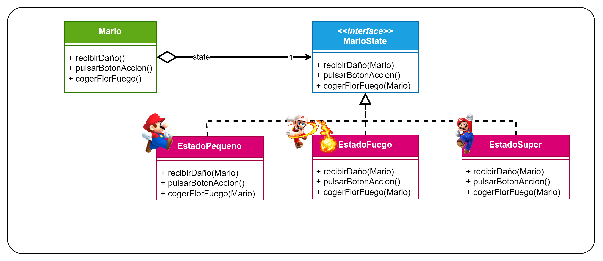

# Patrón State
Patrón de **comportamiento** (se encarga de como interactúan y se reparten responsabilidades de objetos) y de 
**objetos** (usa la composición en vez de la herencia).

Este es el diagrama UML que se utilizó para este ejemplo:

Aunque de primeras puede parecer que el diagrama es igual que el del patrón Strategy tenemos que fijarnos en varias cosas:
- En el patrón Strategy normalmente tendremos un único método que será el que redefinan las clases concretas dependiendo
de la estrategia que se escoja; mientras que en el Patrón State pueden existir distintos métodos que no tengan nada que 
ver entre ellos.
- El patrón Stategy es el **cliente** el que decida que estrategia escoger, en cambio en el Patrón State, los estados
deben de ser transparentes para el cliente; este no debe de saber cuales son los estados ni cuando se han de cambiar,
eso es lo que hará la interfaz Context o los ConcreteStates.
  - Si son los propios ConcreteStates tendremos otra diferencia con respecto al Patrón Strategy: los estados se conocen
  entre ellos, mientras que el Patrón Strategy las estrategias NO se conocen, son independientes.