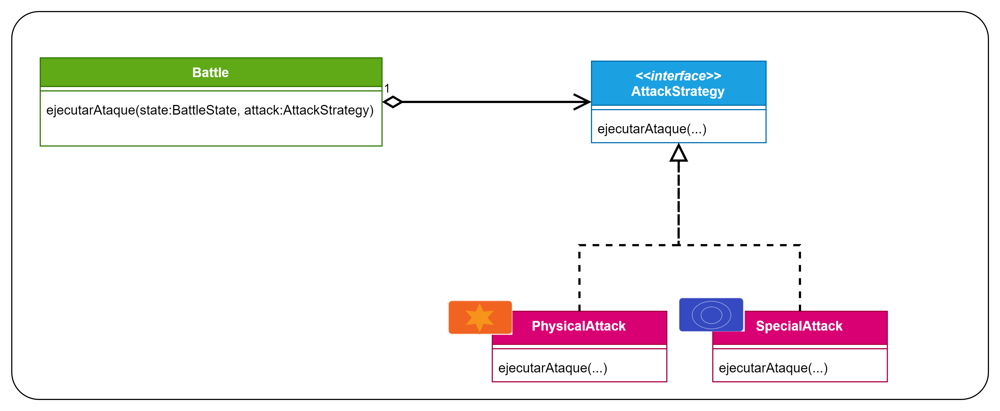

# Patrón Strategy
Patrón de **comportamiento** (se encarga de como interactúan y se reparten responsabilidades de objetos) y de
**objetos** (usa la composición en vez de la herencia).

Este es el diagrama UML que se utilizó para este ejemplo:

> **OJO:** No confundir este patrón con el Patrón State. Cada uno tiene su propósito. El patrón Strategy es para cuando 
tengamos distintas estrategias que queremos que sea el propio cliente que las cambie (además de que generalmente
tendremos solo un método); el Patrón State es para cuando tengamos distintos estados y el cliente NO debe de saber cuando
se cambian ni cuales hay. 

