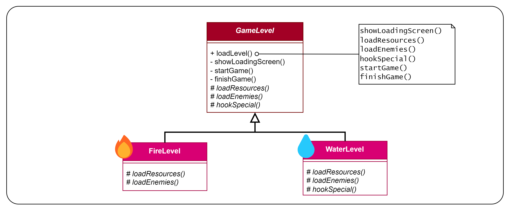

# Patrón Template Method
Patrón de **comportamiento** (se encarga de como interactúan y se reparten responsabilidades de objetos) y de
**clases** (usa la herencia en vez de la composición).

Este es el diagrama UML que se utilizó para este ejemplo:

`loadLevel()` es el método plantilla (template method) que llamará tanto a métodos privados de su clase 
(`showLoadingScreen()`,`startGame()`, `finishGame()`), como métodos primitivos/abstractos 
(`loadResources()`, `loadEnemies()`), como operaciones "de enganche" (`hookSpecial()`). Estos úlitmos son como operaciones
"opcionales", que tienen una implementación predeterminada vacía, y las subclases que quieran pueden reescribirlo.