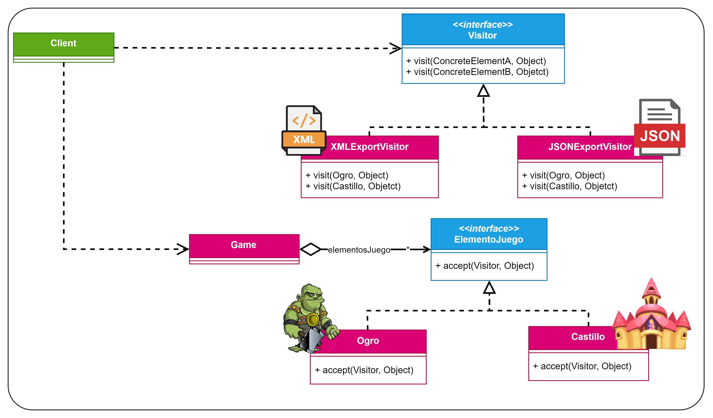

# Patrón Visitor
Patrón de **comportamiento** (se encarga de como interactúan y se reparten responsabilidades de objetos) y de
**objetos** (utiliza la composición en vez de la herencia).

Este es el diagrama UML que se utilizó para este ejemplo:
