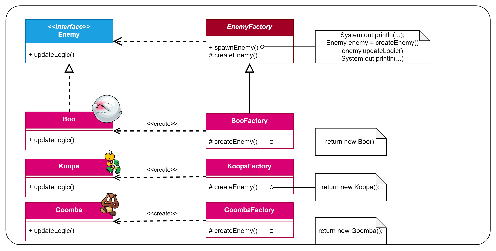

# Patrón Factory Method
Patrón de **creación** (soluciona el problema de usar `new`) y de **clases** (usa la herencia en vez de la composición).

Este es el diagrama UML que se utilizó para este ejemplo:

