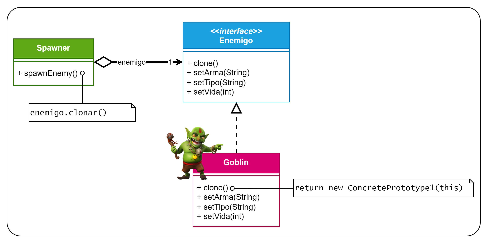

# Patrón Prototype
Patrón de **creación** (soluciona el problema de usar `new`) y de **objetos** (usa la composición en vez de la herencia).

Este es el diagrama UML que se utilizó para este ejemplo:
