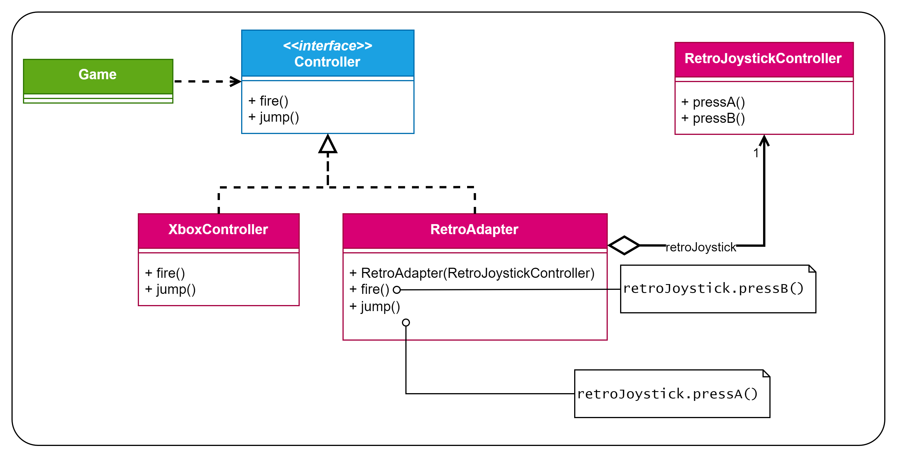

# Patrón Adapter
Patrón **estructural** (se encarga de cómo se ensambla las clases y los objetos) de **clases** (utiliza la herencia en 
vez de la composición) y de **objetos** (utiliza la composición en vez de la herencia).

Este es el diagrama UML que se utilizó para este ejemplo:

Como se puede ver en el ejemplo, hemos utilizado la versión del patrón de objetos (la que usa composición en vez 
de herencia). Esto es debido a varios motivos:
- Si en un futuro nos vienen y nos dicen que han añadido nuevos tipos de mandos que se asemejan al `RetroJoystickContoller`
que ya tenemos, con esta estructura, solo tendremos que añadir las subclases nuevas (`RetroJoystickEdicionEspecial`,...)
que hereden de nuestro `RetroJoystickController`. Esto es debido a que adaptador de objetos "adapta el propio objeto 
y todas sus subclases".
  - Esto no lo conseguiriamos con el adaptador de clases debido a que está fuertemente acoplado porque 
  "adapta una clase adaptadora concreta"
- En un videojuego real, los mandos no se crean estáticamente desde el código; el sistema operativo o el motor de 
juego detectan el hardware cuando el usuario lo conecta físicamente al puerto USB, entregándote una instancia que ya 
existe. Un adaptador de objetos permite adaptar objetos existentes, dando la enorme ventaja de "coger un objeto ya 
creado y «envolverlo», adaptándolo en tiempo de ejecución". En la versión de clases, "la adaptación solo puede ser 
hecha en el momento de la creación del objeto" , lo que obligaría contractualmente a tener que "cambiar los «new»" 
de un código que ni siquiera controlamos (puede que el código del mando que queramos adaptar esté en una librería que 
nos haya dado Steam, por ejemplo, y no podemos cambiar).
