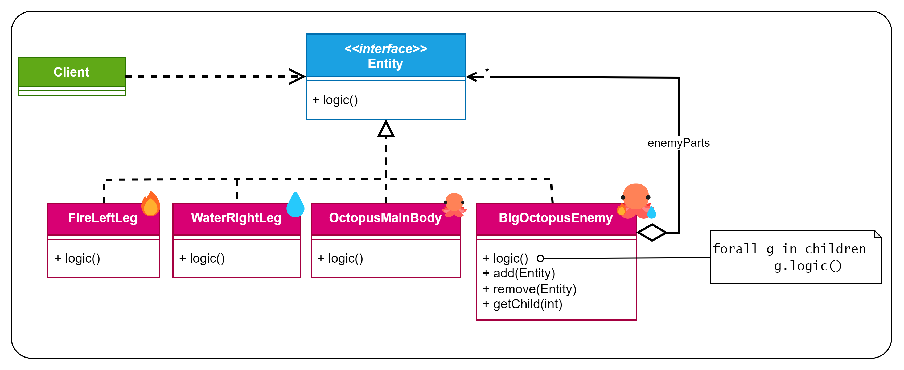

# Patrón Composite
Patrón **estructural** (se encarga de cómo se ensambla las clases y los objetos) y de **objetos** 
(utiliza la composición en vez de la herencia).

Este es el diagrama UML que se utilizó para este ejemplo:

En este caso y siguiendo las indicaciones de las transparencias por encima de lo que dicta el libro GoF, se han 
declarado los métodos de gestión de los hijos (`add(Entity)`, `remove(Entity)` y `getChild(int)`) en la propia clase 
compuesta (`BigOctopusEnemy`)