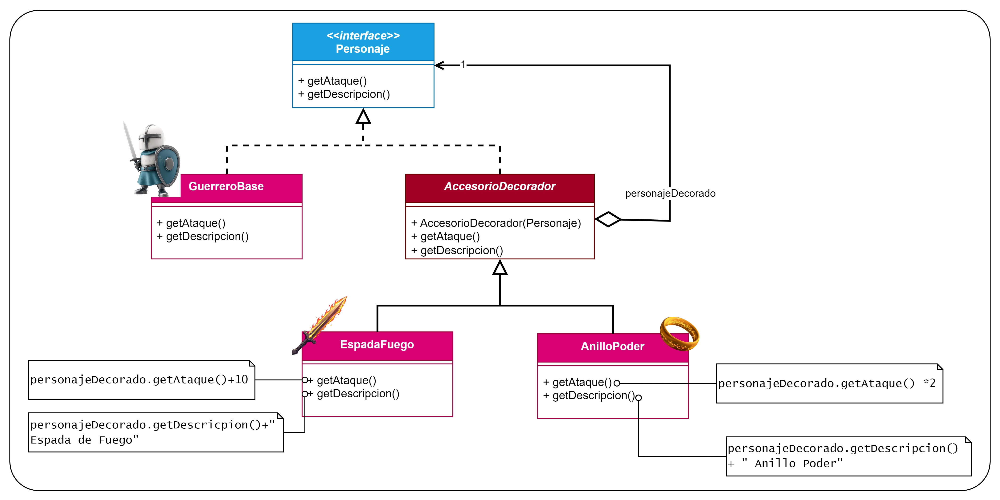

# Patrón Decorator
Patrón **estructural** (se encarga de cómo se ensambla las clases y los objetos) y de **objetos**
(utiliza la composición en vez de la herencia).

Este es el diagrama UML que se utilizó para este ejemplo:

En este ejemplo tenemos una interfaz `Personaje` de la que implementarán las clases concretas los métodos definidos en
ella (`getAtaque()`: que devuelve un entero, simulando el daño que puede hacer nuestro personaje; `getDescripcion()` 
que devuelve un `String` que contiene una descripción del personaje).  
Esta interfaz será implementada por el `GuerreroBase` que será nuestro personaje principal "desnudo" (sin ningún 
equipamiento que le haga aumentar sus habilidades).  
Y aquí es donde viene lo importante del Patrón Decorator: la clase Abstracta `AccesorioDecorador` que implementará la 
interfaz anterior y guardará una instancia de un objeto de ella, es decir, guardará un Personaje Base que utilizará para
saber donde se están guardando los accesorios. De esta clase abstracta extenderán `EspadaFuego` que aumentará el ataque
de nuestro personaje principal en 10 unidades; y `AnilloPoder` que multiplicará el ataque del personaje principal por 2.